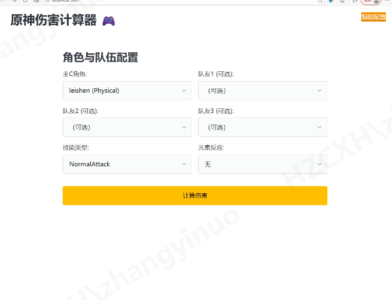
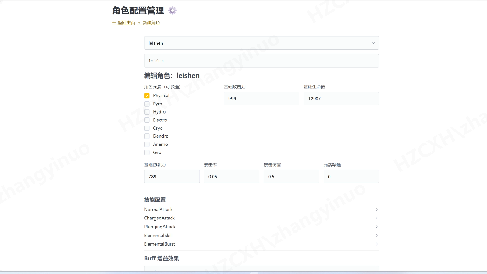

原神全自动圣遗物遗传算法优化器
超详细新手指南（Ultra-Detailed Beginner Guide）
本工具是一个基于遗传算法的工业级伤害模拟优化器。它能自动装配你的圣遗物、准确判定套装效果、结合角色自身天赋（Self-Buff）和队友Buff（Team-Buff），在数以亿计的组合中搜索全局最优伤害面板，帮助你找到角色真正的最强配装。
适用于追求极致输出的玩家，支持复杂队伍Buff、元素反应、减抗减防等高级计算。

一、安装与环境准备（从零开始）

安装 Python
下载 Python 3.10 或更高版本（推荐 3.12）。
官网：https://www.python.org/downloads/
安装时务必勾选 “Add Python to PATH”（添加到环境变量）。

克隆或下载项目代码
如果你有 Git：打开命令提示符（CMD），输入：textgit clone [项目仓库地址]  # （如果有GitHub/Gitee链接，请替换这里）
或者直接从 GitHub/Gitee 下载 ZIP 包解压。

安装依赖库
进入项目文件夹（用 CMD cd 到目录）。
运行：textpip install -r requirements.txt（如果没有 requirements.txt 文件，可能依赖 numpy、scipy 等基本库，手动 pip install numpy scipy matplotlib 如有需要）

准备圣遗物数据
项目支持自动导入游戏内圣遗物（见第三节）。

运行方式
推荐新手直接运行 Web 界面：textpython app.py然后打开浏览器访问：http://localhost:5001
这里可以图形化修改参数、查看结果，非常友好！
高级用户可直接运行：textpython main.py

二、核心逻辑与数据流
工具分为两个主要阶段：

预处理阶段
加载角色基础属性（白字）。
合并 Self-Buff（角色自身）和 Team-Buff（队友），形成“固定面板”。

进化搜索阶段
使用遗传算法（Genetic Algorithm）在所有圣遗物组合中进化迭代。
实时计算套装效果 + 伤害期望（Damage Calculator）。
最终输出伤害最高的几套配装。

三、参数配置详解（手动调参必读）
1. main.py：战斗环境配置
在这里定义当前战斗场景，是最核心的文件。

target_char：角色键名，对应 characters.json 中的键（如 "leishen" 表示雷神）支持中文。
skill_type（最重要！）：决定技能倍率和增伤区匹配。
可选值：
NormalAttack（普攻）
ChargedAttack（重击）
ElementalSkill（元素战技）
ElementalBurst（元素爆发）
PlungingAttack（下落攻击）

reaction（元素反应）：
增幅：vaporize_hydro（水蒸发）、melt_pyro（火融化）
剧变：aggravate（超激化）、spread（蔓激化）

其他：
enemy_level：敌人等级（默认 100）
resistance_percent：减抗后敌人抗性（如初始 10% - 风套40% = -30% → 填 -0.3）

2. characters.json：角色Self-Buff 与技能倍率
定义角色机制。

base_stats：90级角色 + 90级武器基础白字（攻击/生命/防御）。
skills：不同技能的倍率，支持混合（如 atk_percent + em）。
buffs (Self)：仅作用于本角色的Buff。
buffs (Team)：作用到计算目标的队友Buff。
示例（那维莱特 30% 水伤）：JSON{ "type": "elemental_bonus", "value": 0.30, "element": "Hydro" }

3. set_effects.json：套装效果配置
定义4件套效果。
关键：type 必须与 skill_type 匹配，否则吃不到加成。
例如计算重击时，用 charged_bonus 或通用 damage_bonus，不要错写成 skill_bonus。
4. 关键Buff类型字典（参考 buff_types.md）
严格遵守拼写，否则乘区失效！
| 乘区分类 | type 字段              | 适用场景                          |
|----------|-------------------------|-----------------------------------|
| 基础区   | atk_percent            | 攻击力百分比加成（基于白字）     |
|          | atk_flat               | 攻击力固定值加成                  |
|          | hp_percent             | 生命值百分比加成                  |
|          | hp_flat                | 生命值固定值加成                  |
|          | em                     | 元素精通                          |
| 增伤区   | damage_bonus           | 全伤害加成（所有伤害通用）        |
|          | elemental_bonus        | 元素伤害加成（需指定 element，如 "Hydro"） |
|          | charged_bonus          | 重击专属增伤（需 skill_type 为 ChargedAttack） |
|          | attack_bonus          | 普攻专属增伤（需 skill_type 为 NormalAttack） |
|          | plunging_bonus          | 下落攻击专属增伤（需 skill_type 为 PlugingAttack） |
|          | skill_bonus            | 元素战技专属增伤（需 skill_type 为 ElementalSkill） |
| 双暴区   | crit_rate              | 暴击率                            |
|          | crit_dmg               | 暴击伤害                          |
| 特殊区   | def_reduction          | 减防（如雷神2命、草神2命）       |
|          | resistance_reduction   | 减抗（如风套4件、钟离盾）        |

乘区分类type 字段适用场景基础区atk_percent / atk_flat攻击力加成（百分比基于白字）hp_percent / hp_flat生命值加成em元素精通增伤区damage_bonus全伤害加成elemental_bonus元素伤害（需指定 element）charged_bonus重击专属（匹配 ChargedAttack）skill_bonus战技专属（匹配 ElementalSkill）双暴区crit_rate / crit_dmg暴击率 / 暴击伤害特殊区def_reduction减防（如雷神2命）resistance_reduction减抗（如风套、钟离）

四、圣遗物自动化导入（YAS + Parser）

扫描游戏圣遗物
下载 YAS 工具：https://github.com/wormtql/yas/releases
运行 raw/yas.exe（或最新版 yas.exe）。
游戏内打开圣遗物背包，确保分辨率 1920x1080、全屏或窗口化。
扫描完成后生成 mona.json。

转换格式
运行项目中的 parser(yas_converter).py。
输入 mona.json，输出本项目标准的 artifacts.json。
优势：保留原圣遗物 ID，便于游戏内定位极品件。

五、开发者调试建议

验证固定面板：运行后查看控制台 “[4] 队友后固定面板”。攻击力/增伤不对？检查 team_buffs。
验证增伤匹配：如果 all_damage_bonus 异常（如 1.0），说明套装 type 与 skill_type 不匹配。
算法效率：圣遗物 >1000 件时，将 main.py 中 population_size 调到 800+，避免局部最优。
拼写统一：所有关键词（如 PlungingAttack）必须一致，参考 buff_types.md。

六、快速上手建议

先用 app.py 启动 Web 界面（http://localhost:5001），图形化操作最友好。

导入自己的 artifacts.json。
配置 target_char 和 skill_type。
运行优化，耐心等待（视圣遗物数量，几十秒到几分钟）。
查看输出：最高伤害配装 + 详细面板对比。
